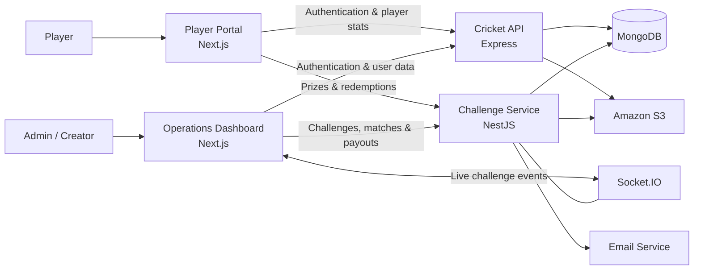

  <h3>A full-stack cricket gaming and challenge platform</h3>

  <p>
    CricWar connects competitive cricket gameplay with configurable challenges,
    live participation, virtual rewards, prize redemption, and operational tools.
  </p>

  <p>
    
    
    
    
    
    
  </p>
</div>

## Overview

CricWar is a multi-application platform built around competitive cricket experiences. Players can track in-game currencies, browse rewards, and submit prize redemption requests. Creators and administrators can configure match scenarios, manage challenges, monitor participation, review creator requests, maintain the prize catalog, and process payouts.

The repository brings together two responsive Next.js applications and two Node.js APIs. Shared JWT authentication connects the services, MongoDB stores platform data, Socket.IO delivers challenge activity in real time, and Amazon S3 supports media and match-situation uploads.

## Highlights

- **Cricket challenges** — configure batting and bowling teams, player lineups, innings type, overs, target runs, wickets, entry fees, winner limits, rewards, level requirements, and expiry.
- **Live participation** — challenge-specific Socket.IO rooms track active players and broadcast winner updates.
- **Player reward market** — display currency balances, browse active prizes, check redemption eligibility, and submit delivery details.
- **Operations dashboard** — manage users, matches, challenges, creator applications, wallets, payouts, and prize inventory from a responsive interface.
- **Cricket game services** — APIs for teams, players, matches, world tours, leaderboards, purchases, promotions, notifications, friendships, and player statistics.
- **Media workflows** — upload challenge artwork, prize images, match-situation files, payout receipts, and spreadsheet data.
- **Role-aware access** — credential-based NextAuth sessions, JWT-protected APIs, and endpoint-level role authorization.
- **API documentation and validation** — Swagger/OpenAPI documentation for the NestJS service and DTO validation through NestJS pipes.
- **Delivery-ready services** — multi-stage Docker builds, standalone Next.js output, environment-based runtime configuration, and Azure Pipelines definitions.

## System Architecture



## Applications

### Operations Dashboard

`main_admin/main_admin`

A responsive Next.js dashboard for administrators and approved creators. It provides workflows for challenge creation, match management, player selection, creator approvals, user administration, funds, payouts, and prize catalog management.

### Player Portal

`player_portal/player_portal`

A player-focused Next.js experience that presents account currency balances and a rewards market. Players can review available prizes and submit authenticated redemption requests with fulfilment details.

### Challenge Service

`service_admin/service_admin`

A modular NestJS API for challenges, admin matches, participation, wallets, payouts, prizes, creator requests, spreadsheet imports, email, S3 media, and real-time challenge events.

### Cricket API

`Backend/backend`

An Express API that powers authentication and core cricket game data, including users, teams, players, matches, world tours, player statistics, leaderboards, purchases, promotions, notifications, friends, and game configuration.

## Technology

**Frontend**

- Next.js 15 with the App Router
- React 18/19 and TypeScript
- Tailwind CSS with Radix UI and reusable component primitives
- Redux Toolkit Query for API state and caching
- NextAuth.js with JWT sessions
- React Hook Form and Zod validation

**Backend**

- NestJS 10 and Express 4
- MongoDB with Mongoose
- REST APIs with Swagger/OpenAPI
- Socket.IO WebSockets
- JWT authentication and role-based authorization
- DTO validation with `class-validator` and `class-transformer`

**Infrastructure and integrations**

- Amazon S3 for object storage and signed media access
- Nodemailer and Handlebars for transactional email
- Firebase Cloud Messaging support
- Docker multi-stage builds
- Azure Pipelines for container build and delivery
- Jest and Supertest for unit and API testing

## Repository Structure

```text
Cric-war/
├── Backend/backend/                  # Express cricket game API
│   ├── modules/                      # Domain-based routes, controllers, and models
│   ├── middleware/                   # Authentication, security, and error handling
│   ├── startup/                      # Database, routing, and logging bootstrap
│   └── tests/                        # API test suites
├── service_admin/service_admin/      # NestJS challenge and rewards service
│   ├── src/modules/                  # Feature modules
│   ├── src/database/                 # Mongoose schemas and repositories
│   ├── src/common/                   # Shared services, guards, and utilities
│   └── test/                         # Unit and integration-oriented tests
├── main_admin/main_admin/            # Next.js operations dashboard
│   └── src/                          # App routes, components, hooks, and API slices
└── player_portal/player_portal/      # Next.js player rewards portal
    └── src/                          # App routes, components, contexts, and hooks
```

## Getting Started

### Prerequisites

- Node.js 20+
- npm or Yarn
- MongoDB
- AWS S3 credentials for upload features

### 1. Install dependencies

Run the matching install command in each application directory:

```bash
cd Backend/backend && npm install
cd ../../service_admin/service_admin && npm install
cd ../../main_admin/main_admin && npm install
cd ../../player_portal/player_portal && npm install
```

### 2. Configure environment variables

Create a `.env` file inside each application that you plan to run.

**Cricket API — `Backend/backend/.env`**

```dotenv
PORT=5000
MONGODB_URL=mongodb://127.0.0.1:27017/cricwar
SECRET=replace_with_a_long_random_secret
S3_ACCESS_KEY=
S3_SECRET_ACCESS_KEY=
S3_BUCKET_REGION=
S3_BUCKET_NAME=
```

**Challenge service — `service_admin/service_admin/.env`**

```dotenv
NODE_ENV=development
PROTOCOL=http
HOST=localhost
PORT=3002
MONGODB_URL=mongodb://127.0.0.1:27017/cricwar
JWT_SECRET=use_the_same_signing_secret_as_the_auth_service
AUTH_SERVICE=http://localhost:5000/api/v1
ADMIN_PORTAL=http://localhost:3000
CORS_ORIGINS=http://localhost:3001
S3_ACCESS_KEY=
S3_SECRET_ACCESS_KEY=
S3_BUCKET_REGION=
S3_BUCKET_NAME=
```

**Operations dashboard — `main_admin/main_admin/.env.local`**

```dotenv
API_URL=http://localhost:3002/api/v1
API_AUTH_URL=http://localhost:5000/api/v1/auth/login
WS_URL=http://localhost:3002/challenges
NEXTAUTH_SECRET=replace_with_a_long_random_secret
NEXTAUTH_URL=http://localhost:3000
```

**Player portal — `player_portal/player_portal/.env.local`**

```dotenv
API_URL=http://localhost:3002/api/v1
API_AUTH_URL=http://localhost:5000/api/v1/auth/login
WS_URL=http://localhost:3002/challenges
NEXTAUTH_SECRET=replace_with_a_long_random_secret
NEXTAUTH_URL=http://localhost:3001
```

Add the optional mail, Firebase, payout, and media-size settings when enabling those integrations.

### 3. Start the platform

Open a terminal for each service:

```bash
# Cricket API — http://localhost:5000
cd Backend/backend
npm run watch
```

```bash
# Challenge service — http://localhost:3002
cd service_admin/service_admin
npm run start:dev
```

```bash
# Operations dashboard — http://localhost:3000
cd main_admin/main_admin
npm run dev
```

```bash
# Player portal — http://localhost:3001
cd player_portal/player_portal
npx next dev -p 3001
```

In development, the challenge service exposes interactive API documentation at `http://localhost:3002/docs` and a health endpoint at `http://localhost:3002/v1/health-check`.

## Testing

Both backend applications use Jest. The Express API also uses Supertest for endpoint testing.

```bash
# Express API
cd Backend/backend
npm test
```

```bash
# NestJS service
cd service_admin/service_admin
npm test
```

Coverage reports are available through `npm run test:coverage` in the Express API and `npm run test:cov` in the NestJS service.

## Engineering Focus

This project demonstrates:

- Designing a domain-oriented, multi-service Node.js platform
- Building separate user and operations experiences with Next.js
- Implementing authenticated workflows across multiple applications
- Modeling cricket challenges, currencies, inventory, wallets, and payouts
- Combining REST APIs with room-based real-time communication
- Integrating cloud storage, email, notifications, and containerized delivery
- Maintaining backend confidence through focused Jest test suites

---

<div align="center">
  Built for competitive cricket experiences—from match scenarios to rewards.
</div>
